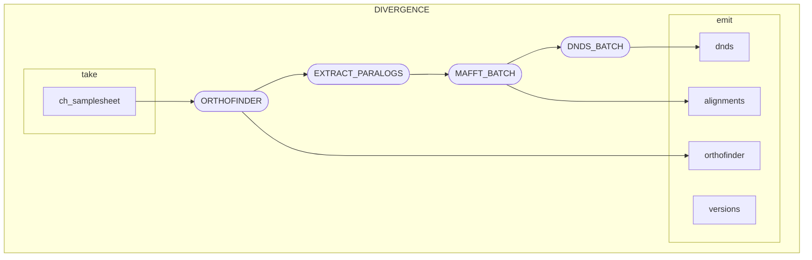

```mermaid
flowchart TB
  subgraph DIVERGENCE
    subgraph take
      v0["ch_samplesheet"]
    end
    v4([ORTHOFINDER])
    v5([EXTRACT_PARALOGS])
    v7([MAFFT_BATCH])
    v10([DNDS_BATCH])
    subgraph emit
      v15["alignments"]
      v17["versions"]
      v16["dnds"]
      v14["orthofinder"]
    end
    v0 --> v4
    v4 --> v5
    v5 --> v7
    v7 --> v10
    v4 --> v14
    v7 --> v15
    v10 --> v16
  end

```