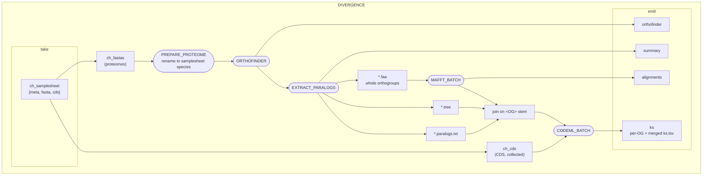

`PREPARE_PROTEOME` renames each proteome to its samplesheet `species` value: OrthoFinder
takes its species names from filenames, and that name is what `--target_species` matches
and what prefixes gene tree tips. `--orthofinder_dir` skips OrthoFinder (and the rename)
and feeds `EXTRACT_PARALOGS` an existing run directly.

The whole orthogroup goes into the alignment, not just the target species' paralogs:
the extra sequences break up long branches so CODEML's multiple-hit correction has
something to work with. Only pairs listed in `*.paralogs.txt` are reported on.

`EXTRACT_PARALOGS` always writes a `<OG>.tree` — empty when no usable tree exists —
so the three-way join is total and no orthogroup is silently dropped.

The OrthoFinder output directory is published whole, so `Gene_Duplication_Events/`
and `Phylogenetic_Hierarchical_Orthogroups/` are available for last-common-ancestor
and ohnolog analysis downstream. The pipeline itself does not compute those.
